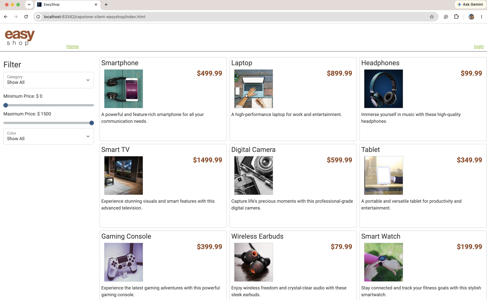
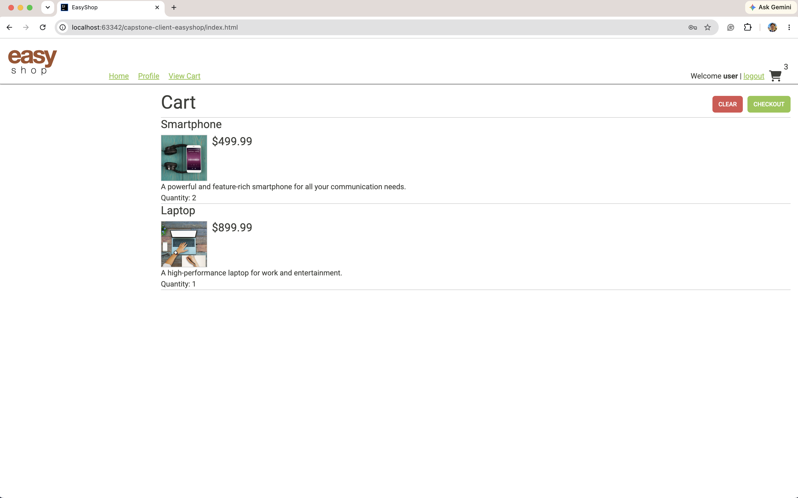
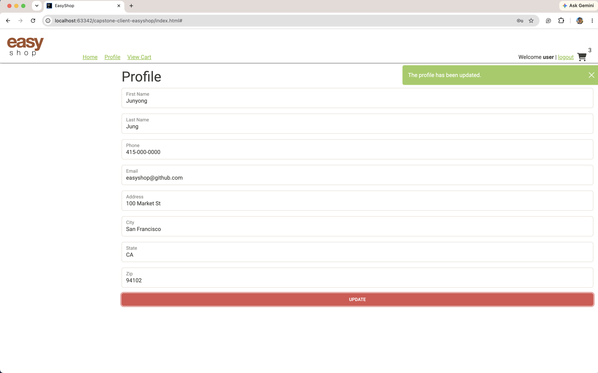
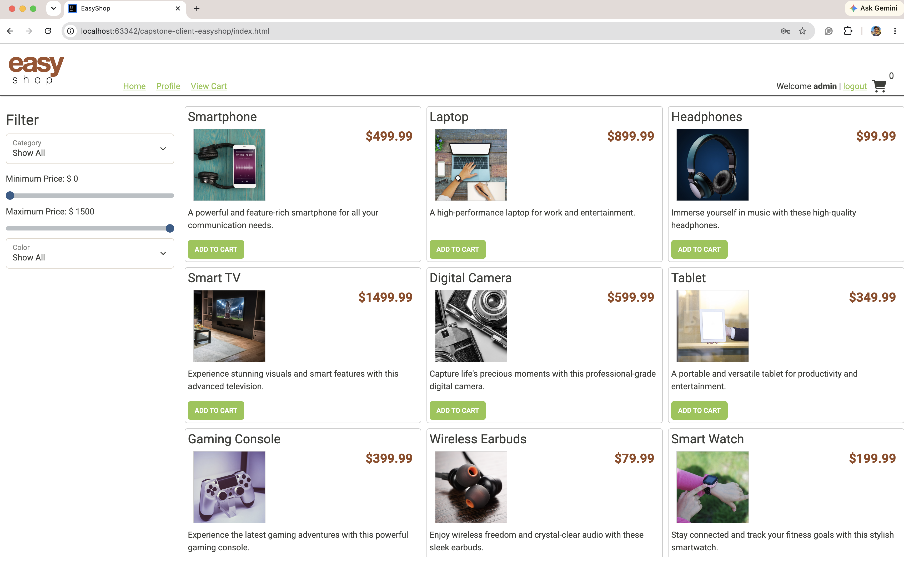
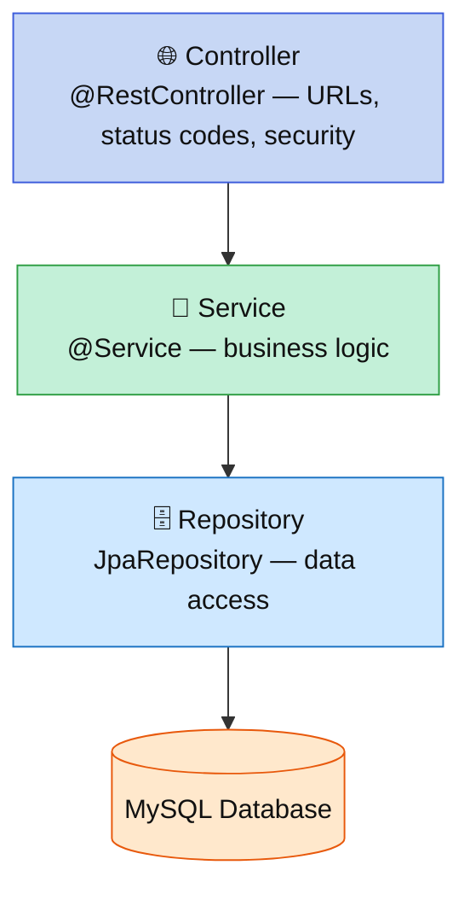
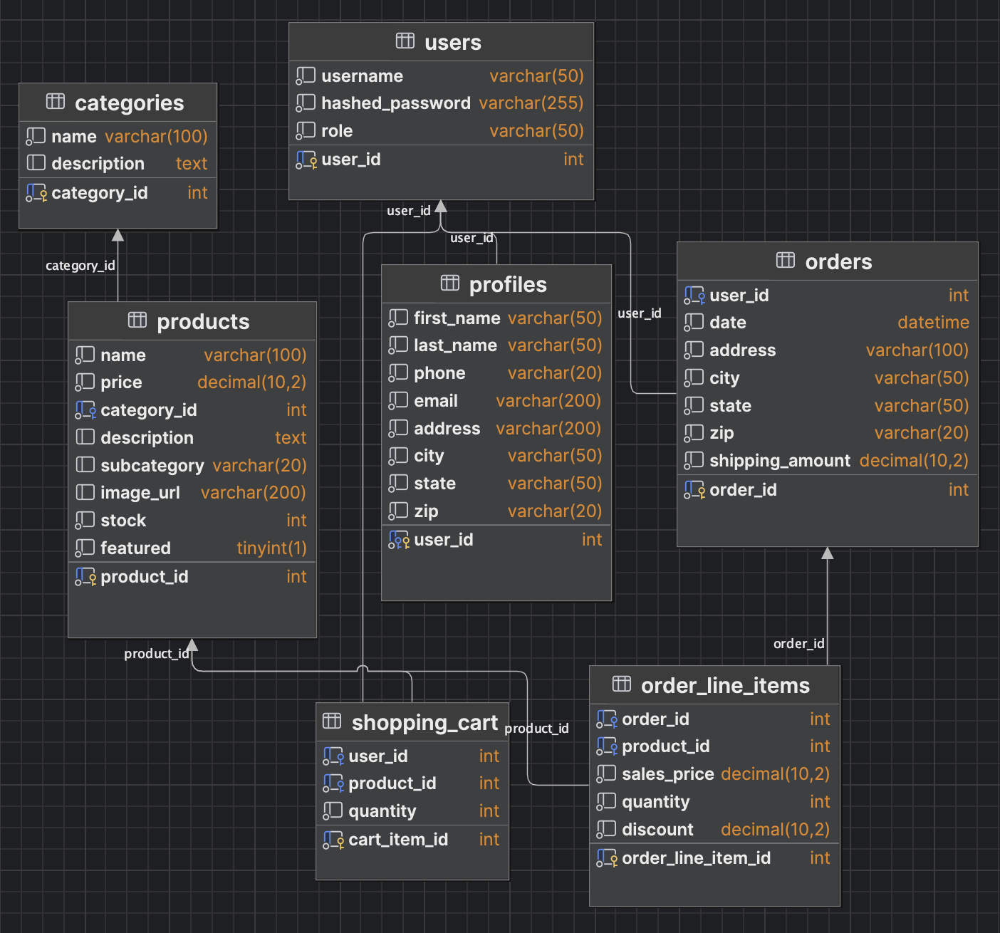
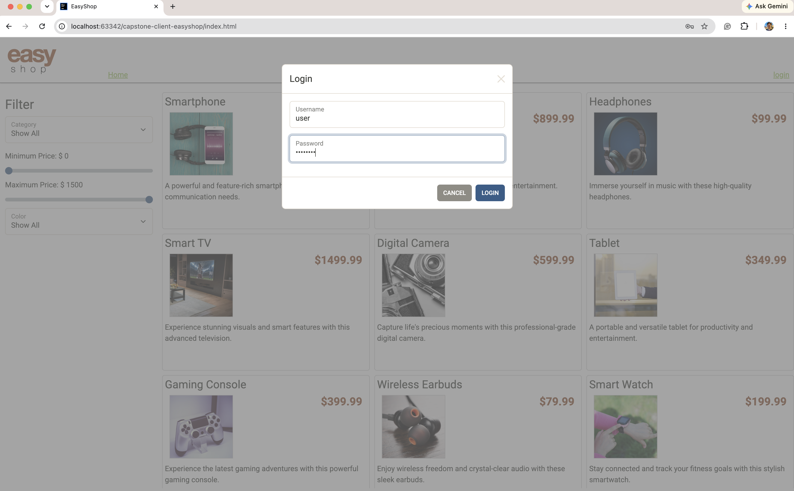

# 🛒 EasyShop — E-Commerce REST API

> The backend "engine" behind an online store. It lets shoppers browse a catalog,
> sign in, fill a shopping cart, manage their profile, and check out — and lets
> store admins manage the products and categories. Built with **Spring Boot** and **MySQL**.




---

## 📖 What is EasyShop? (the plain-English version)

EasyShop is the **behind-the-scenes program** that powers an online store's website.
When a customer clicks "Add to Cart" on the site, the website quietly asks *this* program
to do the work — find the product, remember the cart, place the order — and save it all
to a database. This kind of program is called a **REST API**.

There are two kinds of people who use it:

- 🛍️ **Shoppers** — browse and search products, create an account, add things to a cart, and check out.
- 🛠️ **Admins** — add, edit, and remove products and categories in the store.

## 🛍️ What you can do

**As a shopper**
- Browse the full product catalog and filter by category, price, or color
- Register an account and log in (securely, with a token)
- Add items to your cart, change quantities, or empty it
- View and update your profile
- Check out — turn your cart into an order

Add items to the cart (here: 2 phones + 1 laptop), then check out:



View and update your profile:



**As an admin**
- Create, edit, and delete products and categories
- Regular shoppers are blocked from these — only admins can manage the catalog



## 🏗️ How it's built (in three layers)

The app is organized into three simple layers — each with one job. A request flows down and
the answer flows back, which keeps each part small and easy to test:



## 🗄️ Database

Seven related tables back the store. `users` owns `profiles`, `orders`, and `shopping_cart`;
`products` belong to a `category`; and an order is one `orders` row plus one `order_line_items`
row per product. (Diagram reverse-engineered from the actual `easyshop` schema.)



## ✨ What I built and fixed

**🐛 Fixed two hidden bugs (with tests):**
1. **Search was hiding most products.** A stray filter only let "featured" items through, so the
   storefront showed a fraction of the catalog. Removed it — now search returns everything that matches.
2. **Product edits weren't fully saving.** Editing a product returned "OK" but the **stock** never
   changed. Fixed so every field saves.

**🚀 Built new features:**
- **Categories** — full create / read / update / delete (admin-only writes)
- **Shopping cart** — add (or increase quantity), update, and clear
- **User profile** — view and update your own info
- **Checkout** — convert a cart into a saved order

**🛡️ Added input validation + clean errors (bonus):**
- Bad input (blank name, negative price…) is rejected with a clear `400` message saying exactly
  what's wrong — instead of saving junk or crashing.

## 💡 An interesting piece of code — `OrderService.checkout`

Turning a cart into an order means **several database writes**: insert the order, insert one
line item per product, then empty the cart. If one failed halfway, you'd get a broken order.
Two things make this method interesting:

**1. It's all-or-nothing (`@Transactional`).** The whole method runs in one transaction —
if anything throws, every write rolls back, so there are never half-finished orders.

**2. Save the order first to get its database-generated id.** The line items need the
`order_id`, but that id doesn't exist until the order row is inserted. So I save the order
first, read back the id the database assigned, and attach it to each line item.

```java
@Transactional
public Order checkout(int userId)
{
    ShoppingCart cart = shoppingCartService.getByUserId(userId);

    if (cart.getItems().isEmpty())
        throw new ResponseStatusException(HttpStatus.BAD_REQUEST, "Cannot checkout an empty cart.");

    // save the order header first -> the DB assigns its id
    Order savedOrder = orderRepository.save(order);   // before: id = 0, after: id = DB value

    // one line item per product, linked by that new id
    for (ShoppingCartItem item : cart.getItems().values())
    {
        OrderLineItem lineItem = new OrderLineItem();
        lineItem.setOrderId(savedOrder.getOrderId());
        lineItem.setProductId(item.getProductId());
        lineItem.setSalesPrice(item.getProduct().getPrice());
        lineItem.setQuantity(item.getQuantity());
        orderLineItemRepository.save(lineItem);
    }

    shoppingCartService.clear(userId);   // empty the cart
    return savedOrder;
}
```

---

## 🚀 Getting started

**You'll need:** JDK 17+ and a running MySQL server.

1. **Create the database** (in MySQL Workbench, or the terminal):
   ```bash
   mysql -u root -p < database/create_database_easyshop.sql
   ```
   This builds the `easyshop` database, its tables, and sample data.
2. **Tell the app your MySQL login** via environment variables (kept out of the code):
   - `DB_USERNAME` — e.g. `root`
   - `DB_PASSWORD` — your MySQL password
3. **Start the API:**
   ```bash
   ./mvnw spring-boot:run
   ```
   It runs at `http://localhost:8080`.

> [!TIP]
> **Sample logins** (password is `password` for all): `user` (shopper) and `admin` (admin).

## 🔐 Authentication
- `POST /register` → `{ "username", "password", "confirmPassword" }`
- `POST /login` → `{ "username", "password" }` → returns a **JWT token**
- Send the token on protected requests: `Authorization: Bearer <token>`



## 📡 API reference

### Categories
| Method | Path | Access | Notes |
|---|---|---|---|
| GET | `/categories` | public | all categories |
| GET | `/categories/{id}` | public | one category (404 if missing) |
| GET | `/categories/{id}/products` | public | products in a category |
| POST | `/categories` | ADMIN | create → 201 |
| PUT | `/categories/{id}` | ADMIN | update |
| DELETE | `/categories/{id}` | ADMIN | delete → 204 |

### Products
| Method | Path | Access | Notes |
|---|---|---|---|
| GET | `/products` | public | search params: `cat`, `minPrice`, `maxPrice`, `subCategory` |
| GET | `/products/{id}` | public | one product (404 if missing) |
| POST | `/products` | ADMIN | create → 201 |
| PUT | `/products/{id}` | ADMIN | update |
| DELETE | `/products/{id}` | ADMIN | delete → 204 |

### Cart · Profile · Orders (all require login)
| Method | Path | Notes |
|---|---|---|
| GET | `/cart` | the current user's cart |
| POST | `/cart/products/{id}` | add (qty 1; +1 if already in cart) → 201 |
| PUT | `/cart/products/{id}` | set quantity — body `{ "quantity": n }` |
| DELETE | `/cart` | empty the cart |
| GET | `/profile` | the current user's profile |
| PUT | `/profile` | update the profile |
| POST | `/orders` | checkout — cart → order, then empties the cart → 201 |

## 🐛 Bug fixes (detail)
1. **Search left products out** — `ProductService.search` ended with `.filter(Product::isFeatured)`, silently dropping every non-featured product. Removed it.
2. **Edits dropped `stock`** — `ProductService.update` copied every field except `stock`. Added `existing.setStock(product.getStock())`.

Both are locked in by unit tests in `ProductServiceTest`.

## 🛡️ Validation & error handling (bonus)
- Bean Validation on `Product` / `Category` (`@NotBlank`, `@Positive`, `@PositiveOrZero`) with `@Valid` on POST/PUT bodies.
- A global `@RestControllerAdvice` (`GlobalExceptionHandler`) turns validation failures into a `400` with a `{ field: message }` body, and `ResponseStatusException`s into a consistent `{ status, message }` — no stack traces exposed.

## 🧪 Testing
```bash
./mvnw test
```
- **16 tests** using `@DataJpaTest` + an in-memory **H2** database seeded by `src/test/resources/test-insert-data.sql` — fast and isolated from real MySQL.
- Covers: both bug fixes; full `CategoryService` CRUD; `ShoppingCartService` (add / increment / update); `ProfileService` (get / update); `OrderService` checkout (incl. empty-cart rejection).
- The web / security / validation layer is exercised through the bundled Insomnia collection.

## 🔮 Future versions

Features I'd build next, ranked by value vs. effort:

1. **Order history ("My Orders")** — view past orders. Builds directly on checkout:
   add `findByUserId` to `OrderRepository`, a `GET /orders` endpoint, and an orders page on the site.
2. **Stock enforcement** — decrement `stock` when an order is placed and block adding
   out-of-stock items (stock checks inside `OrderService.checkout` and `ShoppingCartService`).
3. **Product reviews & ratings** — a `reviews` table, a `ReviewController`/`ReviewService`,
   and an average-rating field on the product response.
4. **Payment processing** — a payment step at checkout (e.g., Stripe) and an order
   `status` column (PENDING → PAID → SHIPPED).
5. **Search paging & sorting** — return products in pages, sortable by price/name,
   using Spring Data `Pageable`.
6. **Wishlist / favorites** — a `wishlist` table and endpoints to save items for later.

## 📂 Project structure
```
src/main/java/org/yearup
├── controllers   # REST endpoints (Products, Categories, ShoppingCart, Profile, Orders, ...)
├── models        # JPA entities + response models
├── repository    # Spring Data JPA repositories
├── service       # business logic
└── security      # JWT authentication & authorization
```
